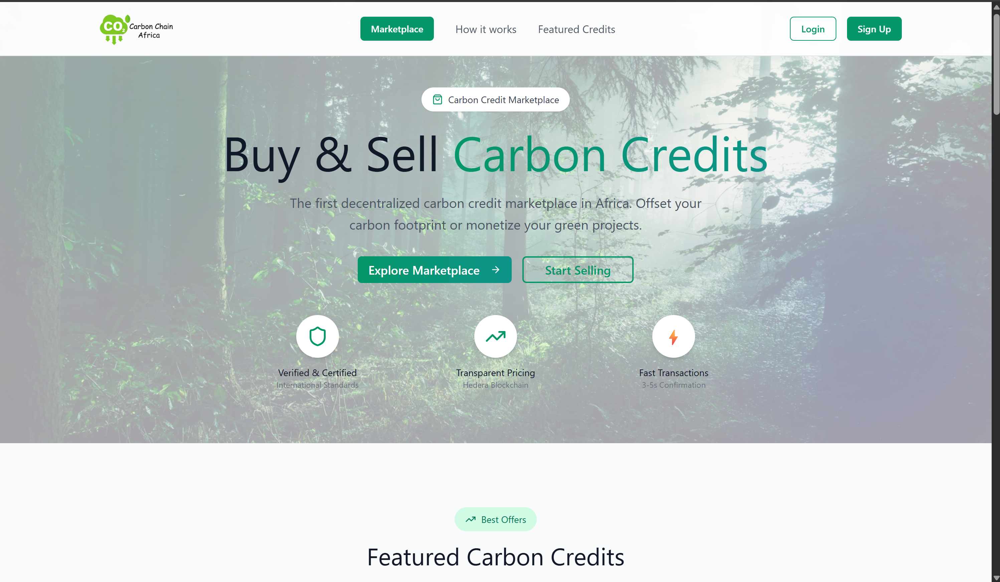
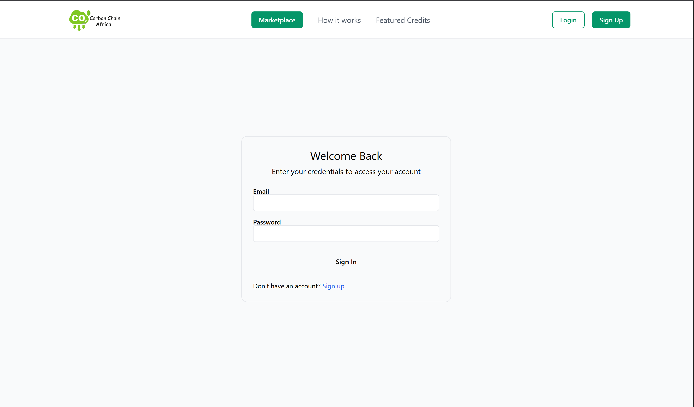
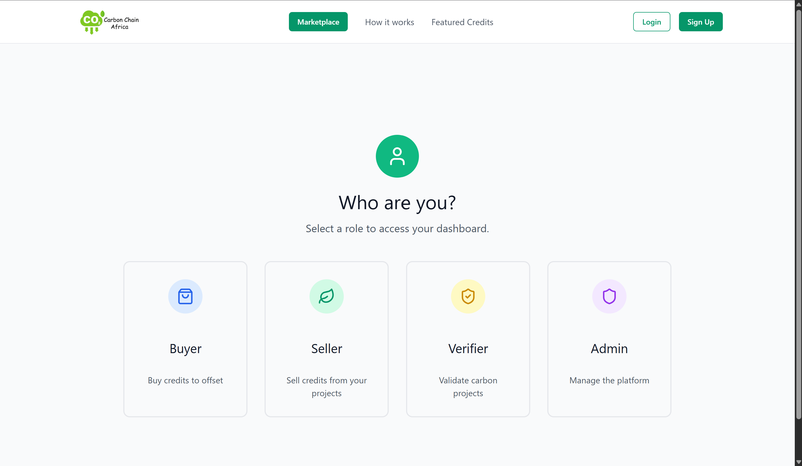
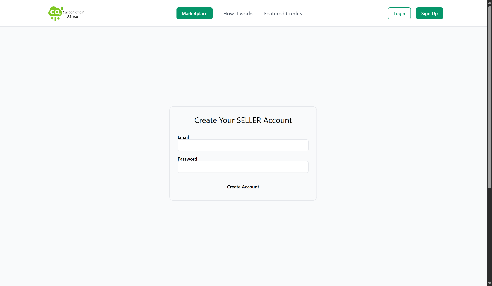
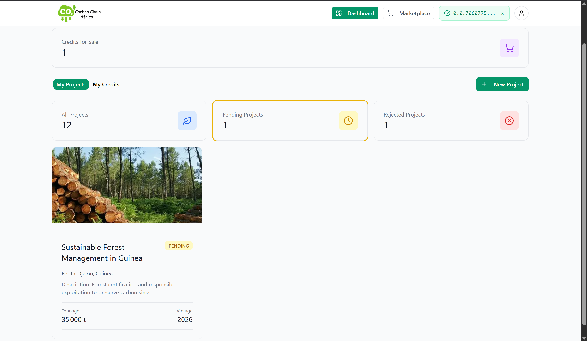
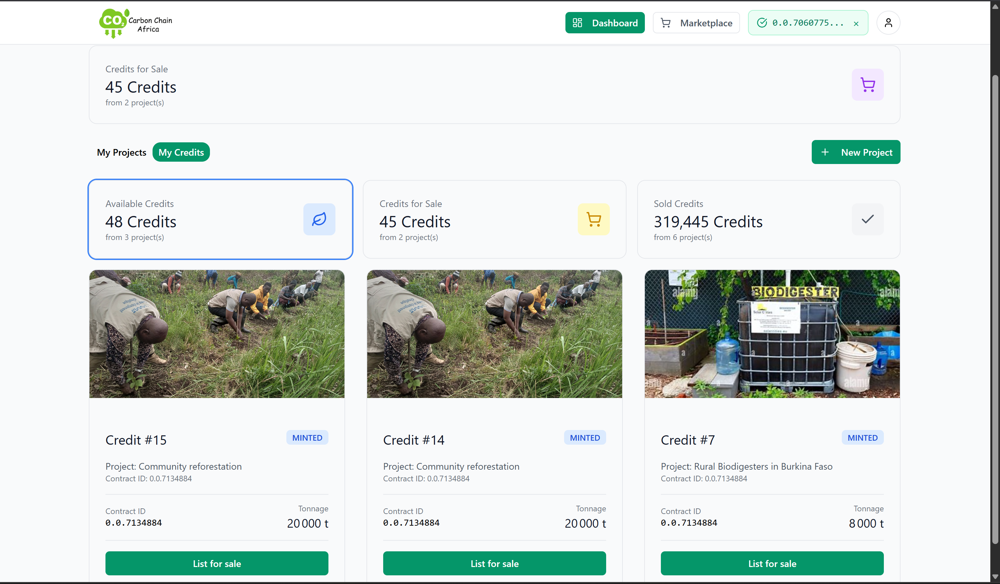
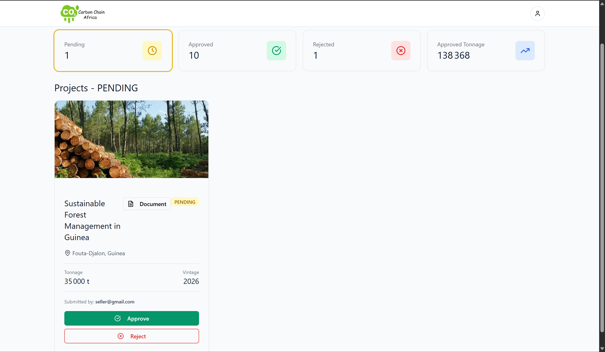
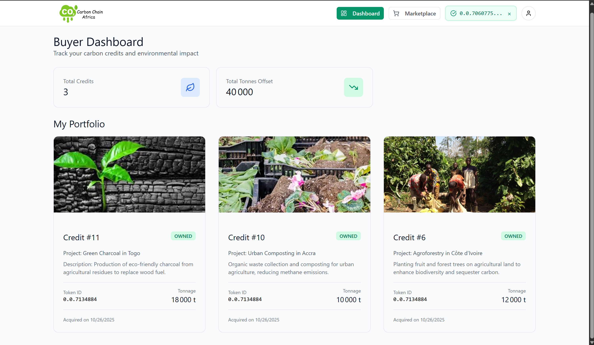
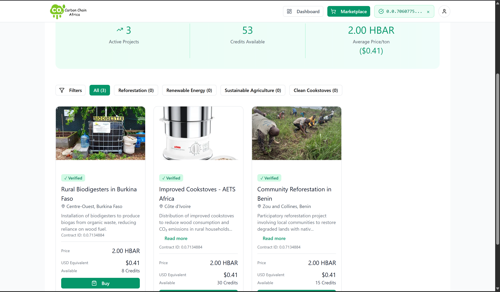

# CarbonChain-Africa Frontend

This directory contains the Next.js backend and frontend application for CarbonChain-Africa. It provides the smart contracts and the user interface for all interactions within the carbon credit marketplace, including project submission, verification, and NFT trading.

## 📋 Table of Contents

- [Overview](#overview)
- [Technology Stack](#technology-stack)
- [Setup and Installation](#setup-and-installation)
- [Key Pages](#key-pages)
- [Services and Hedera Integration](#services-and-hedera-integration)
- [Smart Contract Interaction](#smart-contract-interaction)

## Overview

The frontend is a decentralized application (dApp) built with Next.js, offering a responsive and intuitive user experience. It seamlessly integrates on-chain and off-chain components to create a complete carbon credit marketplace.

**Core Functionalities:**

*   **Role-Based User Experience:** The application provides distinct dashboards and functionalities for different user roles:
    *   **Sellers:** Can submit their carbon projects for verification, manage their minted carbon credit NFTs, and list them for sale on the marketplace. Their dedicated dashboard is `SellerDashboard.tsx`.
    *   **Verifiers:** Have a dedicated dashboard (`VerifierDashboard.tsx`) to review pending projects, assess their documentation, and approve or reject them.
    *   **Buyers:** Can browse a dynamic marketplace of available carbon credits, view project details, and purchase NFTs directly. Their dashboard (`BuyerDashboard.tsx`) allows them to track their portfolio of owned credits.

*   **Seamless On-Chain Interactions:** The frontend integrates with the Hedera network via HashConnect for all on-chain operations. This includes:
    *   Submitting projects to the escrow smart contract.
    *   Approving projects, which triggers the minting of carbon credit NFTs.
    *   Listing, purchasing, and claiming proceeds from NFT sales on the marketplace.

*   **Decentralized Storage:** Project documentation and metadata are stored on IPFS, ensuring data immutability and decentralization. The frontend handles the uploading and retrieval of this data.

*   **Interactive User Workflows:** The application guides users through complex processes with clear, step-by-step interfaces and visual feedback. This includes:
    *   **Project Submission:** A multi-step form for sellers to provide project details and upload documents.
    *   **Verification Process:** A clear and concise interface for verifiers to review and approve projects.
    *   **Marketplace Transactions:** A smooth and secure process for buying and selling carbon credit NFTs, with progress indicators for each step of the transaction.

## Technology Stack

- **Framework**: Next.js, React
- **Language**: TypeScript
- **Styling**: TailwindCSS, Radix UI
- **State Management**: Redux Toolkit
- **Blockchain Interaction**: `@hashgraph/sdk`, `hashconnect`, `ethers.js`
- **API Communication**: Axios
- **Dependencies**: See `package.json` for a full list.

## 🚀 Setup and Installation

Follow these steps to get the frontend up and running:

1.  **Navigate to the frontend directory:**
    ```bash
    cd CarbonChain-Africa/frontend
    ```

2.  **Install dependencies:**
    ```bash
    npm install
    ```

3.  **Configure environment variables:**
    Create a `.env.local` file in the `frontend` directory (you can use `.env.example` as a template). You will need to configure:
    - `NEXT_PUBLIC_OPERATOR_ID`: Hedera Account ID for the Verifier (e.g., `0.0.XXXXXX`).
    - `NEXT_PUBLIC_OPERATOR_KEY`: Private Key for the Verifier account.
    - Ensure the backend API URL is correctly set (e.g., `NEXT_PUBLIC_BACKEND_URL=http://127.0.0.1:8000`).

4.  **Compile and Deploy Smart Contracts:**
    The smart contracts need to be compiled and deployed to Hedera. This project includes a script for this:
    ```bash
    npm run compile:new
    npx tsx scripts/deployNewArchitecture.ts --network testnet
    ```
    This script will deploy the contracts and save their IDs to `deployment-new-architecture.json`, which the frontend uses.

5.  **Start the development server:**
    ```bash
    npm run dev
    ```
    The frontend application will be accessible at `http://localhost:3000`.

## 🧪 Testing Guide

**Prerequisite:** Before you begin, ensure you have three separate Hedera testnet accounts, each funded with some HBAR. You can create testnet accounts through the [Hedera Developer Portal](https://portal.hedera.com/).

To effectively test the end-to-end functionality of the application, we recommend following this workflow:

1.  **👤 Create User Accounts:**
    *   You will need to create three separate user accounts, one for each role: **Seller**, **Verifier**, and **Buyer**.
    *   Use the registration page to create these accounts.

2.  **🌱 Start with the Seller Role:**
    *   Log in as the **Seller**.
    *   Navigate to the **Seller Dashboard** and submit a new carbon project. Fill in the required details and upload the project documents.

3.  **✅ Verify the Project as the Verifier:**
    *   Log in as the **Verifier**.
    *   Go to the **Verifier Dashboard**. You should see the project submitted by the Seller.
    *   Review the project details and approve it.

4.  **🏷️ List the Carbon Credit NFT as the Seller:**
    *   Log back in as the **Seller**.
    *   In the **Seller Dashboard**, you should now see the approved project and the newly minted carbon credit NFT.
    *   List the NFT for sale on the marketplace.

5.  **🛒 Purchase the Carbon Credit NFT as the Buyer:**
    *   Log in as the **Buyer**.
    *   Go to the **Marketplace** and find the listing created by the Seller.
    *   Purchase the carbon credit NFT.

**💡 Important Advice for Testers:**

> To avoid issues with automatic wallet reconnection and to smoothly switch between roles, we strongly recommend using a different browser (e.g., Chrome, Firefox, Edge) for each user role. This will ensure that you are always using the correct wallet and user account for each step of the testing process.

## Key Pages

Here are some of the key pages of the CarbonChain-Africa platform:

-   `pages/index.tsx`: The landing page of the application.
    

-   `pages/login.tsx`: User login page.
    

-   `pages/select-role.tsx`: Page for users to select their role (Seller, Verifier, Buyer) before signing up.
    

-   `pages/register.tsx`: User registration page.
    


-   `pages/dashboard.tsx`: The **Role-Specific Dashboard**. This personalized hub dynamically adapts its content based on the user's assigned role.
    -   `components/dashboards/SellerDashboard.tsx`: Allows sellers to submit and manage their projects and carbon credit NFTs.
        
        
    -   `components/dashboards/VerifierDashboard.tsx`: Enables verifiers to review and approve/reject pending projects.
        
    -   `components/dashboards/BuyerDashboard.tsx`: Lets buyers track their purchased carbon credits and their environmental impact.
        
    -   `components/dashboards/AdminDashboard.tsx`: Provides administrative functionalities.

-   `pages/marketplace.tsx`: The main marketplace for browsing and purchasing carbon credit NFTs.
    


## Services and Hedera Integration

The `src/services` directory contains modules for interacting with various parts of the system, abstracting complex logic and promoting reusability:

-   `authService.ts`: Handles user authentication (login, registration) with the Django backend.
-   `projectService.ts`: Communicates with the backend for managing carbon projects and listings.
-   `ipfsService.ts`: Manages uploads and retrieval of data from IPFS for project metadata and documents.
-   `escrowService.ts`: Interacts directly with the `CarbonProjectEscrow` smart contract for project submission and verification.
-   `nftService.ts`: Handles interactions related to the `CarbonCreditNFT` and `CarbonCreditMarketplace` contracts.

### HashConnect Integration (`hashconnect.ts` & `useHashConnect.ts`)

Our frontend features a robust and secure integration with Hedera wallets via **HashConnect**. This service (`hashconnect.ts`) initializes and manages the connection, while a custom hook (`useHashConnect.ts`) provides a centralized and reusable way to manage wallet state and interactions across the application.

**Key Features of HashConnect Integration:**
-   **Real HashConnect SDK Integration**: Uses actual HashConnect v3 for secure and reliable wallet connections (e.g., HashPack, Blade Wallet).
-   **Secure Transaction Signing**: Enables users to sign Hedera transactions directly from their connected wallet without exposing private keys to the application.
-   **Wallet State Management**: Manages pairing events, disconnection events, and connection status changes, persisting wallet state across page navigation.
-   **Error Handling**: Gracefully handles connection failures and transaction errors.
-   **Redux State Management**: Integrates with Redux for clean and centralized management of HashConnect-related state.

**Configuration:**
-   The HashConnect service is configured for the Hedera **Testnet** environment.
-   It uses a specific `projectId` and `appMetadata` for identification within the HashConnect network.

**Usage:**
Users can connect their Hedera wallets via a dedicated "Connect Wallet" button. Once connected, their Hedera Account ID is displayed, and they can proceed with blockchain-related operations.

## Smart Contract Interaction

The frontend interacts with the Hedera network primarily through `ethers.js` and the `@hashgraph/sdk` for direct contract calls and transaction signing. Key interactions include:
-   Submitting projects to the `CarbonProjectEscrow` contract.
-   Verifiers approving projects, which triggers NFT minting.
-   Listing and purchasing NFTs on the `CarbonCreditMarketplace` contract.
-   Claiming proceeds from sales.

Contract ABIs and deployed addresses are managed via the `deployment-new-architecture.json` file, generated during the deployment script execution.
